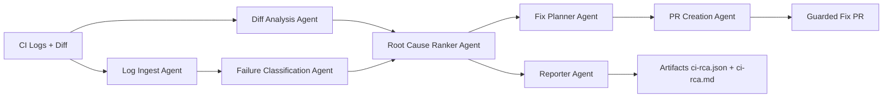

# ci-rootcause

Deterministic multi-agent CI root-cause analysis engine for failed CI runs.

## Purpose

`ci-rootcause` analyzes CI failures and produces:

- Structured failure graph
- Deterministic root-cause ranking
- Deterministic confidence score
- Evidence-backed fix plan
- Deterministic patch plan operations (`modify/create/delete/rename`)
- Optional guarded fix PR (never auto-merged)
- `ci-rca.json` and `ci-rca.md` artifacts
- `ci-rca-observability.json` run telemetry artifact (trace/timing/failure taxonomy)

Primary runtime target is GitHub Actions.
Provider adapter defaults support GitHub Actions and GitLab CI metadata resolution.

## Architecture Overview



## Local Setup

Requirements:

- Python 3.11+

Install tools:

```bash
python -m pip install --upgrade pip
pip install -r requirements.txt
pre-commit install
```

Run checks:

```bash
ruff check .
ruff format --check .
pytest
```

## Quickstart

1. Install dependencies:

```bash
pip install -r requirements.txt
```

2. Run the local pipeline once:

```bash
ci-rootcause \
  --log-path fixtures/ci-logs/github-actions-python-failure.log \
  --diff-path fixtures/diffs/refactor-only.diff \
  --output-dir artifacts \
  --timestamp 2026-02-21T00:00:00Z \
  --commit abc123 \
  --run-id gha_quickstart_1 \
  --base-commit abc122 \
  --head-commit abc123 \
  --repository owner/repo
```

3. Inspect generated artifacts:
- `artifacts/ci-rca.json`
- `artifacts/ci-rca.md`

## Local CLI Execution

Run end-to-end deterministic analysis locally:

```bash
ci-rootcause \
  --log-path fixtures/ci-logs/github-actions-python-failure.log \
  --diff-path fixtures/diffs/refactor-only.diff \
  --historical-runs-path fixtures/classification/historical-runs.sample.json \
  --output-dir artifacts \
  --timestamp 2026-02-20T00:00:00Z \
  --commit abc123 \
  --run-id gha_local_1 \
  --base-commit abc122 \
  --head-commit abc123 \
  --repository owner/repo
```

CLI behavior:

- Writes `ci-rca.json` and `ci-rca.md` into `--output-dir`
- Prints a machine-readable JSON summary to stdout
- Exits `0` for `completed`/`partial` analysis runs, `2` for runtime/input errors
- Supports optional deterministic flaky-test detection via `--historical-runs-path`
- Supports local `--config-path` (simple `key: value`) and single-stream stdin input via `-`
- Supports `--offline-only` to force no remote PR creation/network calls
- Supports rollout profile `--profile safe-github-rollout` (enforces min PR confidence >= `0.90`)

Runtime mode:

- Uses Google ADK runtime orchestration by default when `google-adk` is installed
- Falls back to deterministic local orchestration if ADK runtime initialization fails
- Uses deterministic local orchestration when `--fail-fast` is enabled

## GitHub Action Interface

The action is defined in `action.yml`.

Inputs:

- `github_token` (required)
- `create_fix_pr` (default `false`)
- `post_pr_comment` (default `true`)
- `base_ref`, `head_ref`
- `config_path` (default `.ci-rootcause.yml`)
- `max_fix_files` (default `5`)
- `min_pr_confidence` (default `0.75`)
- `rollout_profile` (default empty, supported: `safe-github-rollout`)
- `offline_only` (default `false`)
- Local/adapter detection supports GitHub Actions and GitLab CI context fields

Outputs:

- `classification`, `confidence`, `primary_root_cause_title`
- `rca_json_path`, `rca_md_path`
- `pr_created`, `pr_url`, `pr_number`

Autonomous PR note:

- If `create_fix_pr=true` and explicit `validated_changes` are not provided, the pipeline can
  synthesize deterministic evidence-backed changes for `TYPECHECK` cases.
- For non-`TYPECHECK` cases, explicit validated changes are still required for PR creation.

Safe rollout profile:

- `safe-github-rollout` keeps guarded PR flow conservative during rollout
- Enforces `min_pr_confidence >= 0.90`
- Keeps `create_fix_pr=false` unless explicitly enabled by workflow input/config
- Example local config: `fixtures/config/safe-github-rollout.yml`

Required workflow permissions:

- `contents: write` (PR creation only)
- `pull-requests: write`
- `actions: read`

Marketplace wrapper sync automation:

- Source repo keeps development workflows; Marketplace wrapper is
  `ibrahim1023/ci-rootcause-action`.
- Release tags (`v*`) trigger `.github/workflows/publish-wrapper.yml` to sync
  `src/`, `action.yml`, `README.md`, and `requirements.txt` into the wrapper repo.
- Wrapper tags are updated to the same release tag and major alias `v0`.
- Wrapper GitHub Release objects are created/updated automatically for the synced tag.
- Required repository secret in source repo: `CI_ROOTCAUSE_ACTION_REPO_TOKEN`
  (PAT with write access to `ibrahim1023/ci-rootcause-action`).

## Architecture Details

Execution order is deterministic and fixed:

1. `log_ingest`
2. `diff_analysis`
3. `failure_classification`
4. `root_cause_ranker`
5. `fix_planner`
6. `reporter`
7. `pr_creation`

Runtime behavior:

- ADK runtime is used by default when available.
- Deterministic local fallback executes on ADK initialization/runtime failure.
- `fail_fast` uses deterministic local orchestration to preserve exception behavior.

## Live GitHub Integration Test (Opt-in)

Live PR creation/idempotency validation is available as an opt-in integration test:

```bash
scripts/run_live_github_test.sh \
  --repo-path /path/to/disposable/repo \
  --repository owner/repo \
  --token ghp_xxx \
  --target-branch main
```

Notes:

- Test is skipped unless `CI_ROOTCAUSE_LIVE_GITHUB=1`.
- Use a disposable repository with push + PR permissions.
- Script prints a cleanup checklist after the test run.

## Marketplace Smoke Test Workflow

You can run a manual in-repo smoke test of the GitHub Action from the Actions tab:

- Workflow: `Smoke Test Marketplace Action`
- Trigger: `workflow_dispatch`
- Behavior:
  - runs `uses: ibrahim1023/ci-rootcause-action@v0.1.4` only
  - uses a deterministic typecheck-style log signal and `create_fix_pr=true`
  - asserts `pr_created=true` and non-empty `pr_url`
  - uploads RCA artifacts (`ci-rca.json`, `ci-rca.md`, `ci-rca-observability.json`)

This workflow is isolated from default CI and is intended only for manual validation.

## MVP Metrics And Release Artifacts

- Benchmark report JSON: `docs/reports/mvp-benchmark-report.json`
- Benchmark report summary: `docs/reports/mvp-benchmark-report.md`
- Release checklist: `docs/release-checklist-v0.1.1.md`
- Benchmark metrics include classification/primary RCA accuracy, confidence reproducibility,
  artifact-hash reproducibility, timing distribution (`mean`/`median`/`p95`), and
  deterministic lift against `basic-log-summarizer-v1` baseline classification accuracy.
- Release notes: `docs/release-notes-v0.1.0.md`
- Known limitations: `docs/limitations.md`

## Known Limitations And Non-Goals

- Current curated benchmark corpus is intentionally small (MVP scope).
- Classification coverage is deterministic-rule based and pattern limited.
- Timing metrics are runtime-derived and marked as nondeterministic metadata.
- Automated fix generation is guardrailed and intentionally conservative.
- No automatic merge or branch-protection bypass is supported.
- No CI rerun orchestration is included in MVP.

## Contributing

Contribution standards are documented in `CONTRIBUTING.md`.
